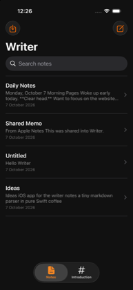
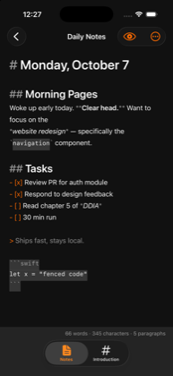
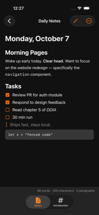
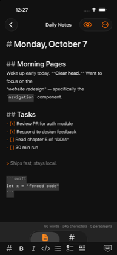
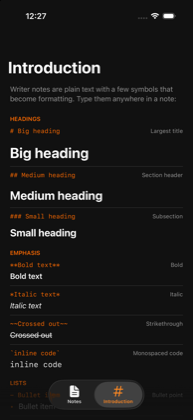
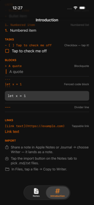

<div align="center">

# Writer

**Fast, lightweight markdown notes for iPhone.**

Plain `.md` files on disk — no accounts, no sync service, no lock-in.
An iOS port of [**writer-computer**](https://github.com/joelbqz/writer-computer).

`iOS 17+` · `SwiftUI` · zero dependencies · `GPL-3.0`

<table>
  <tr>
    <td></td>
    <td></td>
    <td></td>
  </tr>
  <tr>
    <td align="center"><sub><b>Your notes, on disk</b></sub></td>
    <td align="center"><sub><b>Live markdown highlighting</b></sub></td>
    <td align="center"><sub><b>Rendered preview</b></sub></td>
  </tr>
  <tr>
    <td></td>
    <td></td>
    <td></td>
  </tr>
  <tr>
    <td align="center"><sub><b>Markdown toolbar</b></sub></td>
    <td align="center"><sub><b>Built-in syntax guide</b></sub></td>
    <td align="center"><sub><b>Import from anywhere</b></sub></td>
  </tr>
</table>

</div>

## Features

- **Local-first** — notes are plain `.md` files in the app's Documents folder,
  visible and editable in the Files app.
- **Live markdown editing** — headings, bold, italic, code, links, quotes,
  lists, and tasks are styled as you type, with dimmed markers.
- **Rendered preview** — tap the eye to read the note rendered; task
  checkboxes are tappable and update the source.
- **Introduction tab** — a built-in markdown cheat sheet showing each syntax
  raw beside its live render, including a tappable task demo.
- **Markdown keyboard bar** — heading, bold, italic, code, list, task, and
  quote buttons above the keyboard.
- **List continuation** — return on a list item continues the list (numbered
  lists increment; checked tasks continue unchecked); return on an empty
  marker drops out of the list.
- **Search** titles and full text; rename/duplicate/delete via swipe or
  long-press; share the raw `.md` file; live word/character/paragraph count.

## Download

Grab the latest build from [**Releases**](../../releases):

- **`Writer-<version>-simulator.zip`** — prebuilt app for the iOS Simulator:
  unzip, then `xcrun simctl install booted Writer.app`.
- **`Writer-<version>.ipa`** — unsigned archive for sideloading on a real
  device via [AltStore](https://altstore.io) or
  [Sideloadly](https://sideloadly.io) (free Apple ID signing works; the app
  group / share extension needs a paid dev account to work).

## Import your notes

From **Apple Notes**, **Journal**, or anywhere else:

- **Share → Writer** — share a note's text and pick Writer; it lands in the
  notes list as a `.md` file (titled by its first line).
- **Import button** — the ⬇ button on the Notes tab opens the document
  picker for `.md`/`.txt` files (multi-select works).
- **Files app** — tap a file → **Copy to Writer**.

Everything arrives as plain text `.md` in Documents — same folder as
everything else.

## Build

Generated with [XcodeGen](https://github.com/yonsm/XcodeGen):

```bash
brew install xcodegen
xcodegen generate
open Writer.xcodeproj
```

Or headless:

```bash
xcodebuild -project Writer.xcodeproj -scheme Writer \
  -destination 'platform=iOS Simulator,name=iPhone 17' build
xcodebuild -project Writer.xcodeproj -scheme Writer \
  -destination 'platform=iOS Simulator,name=iPhone 17' test
```

## Architecture

Pure SwiftUI + UIKit, zero dependencies:

- `NoteStore` — `.md` files in `Documents/` (file sharing enabled); the list
  sorts by modification time.
- `MarkdownTextView` — `UITextView` (TextKit 1) with an attribute-only
  highlighting pass, cursor-safe while typing.
- `MarkdownParser` — line-oriented block parser for the preview and the
  Introduction guide; inline syntax via `AttributedString(markdown:)`.
- `WriterShare` — share-sheet extension that saves shared text into the
  app-group Inbox; the main app imports it on next activation.

## Credit

Writer for iPhone is based on
[**writer-computer**](https://github.com/joelbqz/writer-computer) by
**[@joelbqz](https://github.com/joelbqz)** — a Tauri/React/Rust desktop
markdown editor for local-first plain-text workflows. This port keeps its
design language (`#111111` background, `#ff6a00` accent), its
"documents on disk" model, and its fast, minimal feel. Huge thanks to the
original author for building it.

## License

[GPL-3.0](LICENSE), same as the original Writer.
