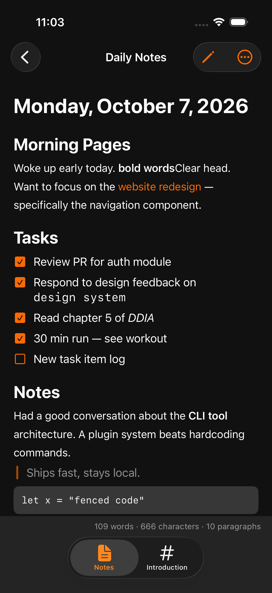

# Writer — markdown notes for iPhone

A fast, lightweight notes app for iPhone, ported from the desktop app
[Writer](https://github.com/joelbqz/writer-computer) by
[@joelbqz](https://github.com/joelbqz).

Like the original, Writer keeps your notes as plain `.md` files on disk —
they show up in the iOS Files app under **On My iPhone › Writer** — renders
markdown live while you type, and stays out of your way.



## Features

- **Local-first plain text** — every note is a `.md` file in the app's
  Documents folder, visible and editable in the Files app. No accounts, no
  sync service, no lock-in.
- **Live markdown editing** — headings, bold, italic, code, links, quotes,
  lists, and task checkboxes are styled as you type, with dimmed syntax
  markers, matching the desktop editor's feel.
- **Rendered preview** — tap the eye to read the note rendered; task
  checkboxes are tappable and update the source.
- **Introduction tab** — a built-in markdown cheat sheet that shows each
  syntax raw beside its live render, including a tappable task demo.
- **Markdown keyboard bar** — heading, bold, italic, code, list, task, and
  quote buttons above the keyboard.
- **List continuation** — return on a list item continues the list (numbered
  lists increment; checked tasks continue unchecked); return on an empty
  marker drops out of the list.
- **Search** across titles and full text, rename/duplicate/delete via swipe
  or long-press, share the raw `.md` file, and a live word/character/
  paragraph count in the editor footer.

## Build

The project is generated with [XcodeGen](https://github.com/yonsm/XcodeGen):

```bash
brew install xcodegen
xcodegen generate
open Writer.xcodeproj
```

Or build/test headless:

```bash
xcodebuild -project Writer.xcodeproj -scheme Writer \
  -destination 'platform=iOS Simulator,name=iPhone 17' build
xcodebuild -project Writer.xcodeproj -scheme Writer \
  -destination 'platform=iOS Simulator,name=iPhone 17' test
```

## Architecture

Pure SwiftUI + UIKit, zero dependencies:

- `NoteStore` — notes are `.md` files in `Documents/` (file sharing enabled);
  the list sorts by modification time.
- `MarkdownTextView` — `UITextView` (TextKit 1) with an attribute-only
  highlighting pass in `MarkdownHighlighter`, cursor-safe while typing.
- `MarkdownParser` — line-oriented block parser for the preview; inline
  syntax goes through Foundation's `AttributedString(markdown:)`.

## Credit

Writer for iPhone is based on
[**writer-computer**](https://github.com/joelbqz/writer-computer) by
**[@joelbqz](https://github.com/joelbqz)** — a Tauri/React/Rust desktop
markdown editor for local-first plain-text workflows. This port keeps its
design language (`#111111` background, `#ff6a00` accent), its
"documents on disk" model, and its fast, minimal feel. Huge thanks to the
original author for building it.

## License

[GPL-3.0](LICENSE), same as the original Writer.
